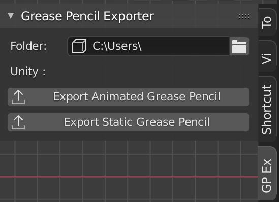
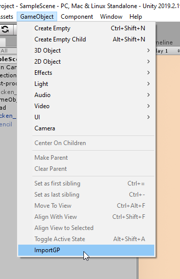
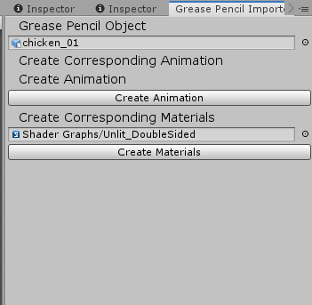

# Grease Pencil to Unity

## Blender Add-On
### Install

* `Folder`: Target Unity Folder to export the Grease Pencil
* `Export Animated Grease Pencil`: Export Selected Animated Grease
  Pencil Object (only one at a time)
* `Export Static Grease Pencil`: Export Selected Static Grease Pencil
  Object (= with only one key)(only one at a time)

Install the "*GP_FBXExportToUnity.py*" as a normal Blender Add-on.
You can find the add-on in the 3D View’s "N" panel.

### Features

The export will create a FBX file and one or two .txt file that contains
the Materials and Keyframes properties in the same folder.

## Unity Script Editor

### Install

Place the *"ImportGP"* in an "Editor" folder inside "Assets" (create
one if it doesn't exist). Shader is to be imported as an asset as
well.

You can find the tool in the "GameObject" menu.

### Features

* `Grease Pencil Object`: Link the FBX of your Grease Pencil Object.
* `Create Animation`: Recreate the animation, it will create a .anim
  on the same folder as the FBX with activation keys.
* `Create Corresponding Materials`: Choose the shader used to create
  the material (A custom shader is available on Gumroad)
* `Create Materials`: Create the Grease Pencil material (support of
  main color and stroke texture) with the shader linked. It will
  create materials on the same folder as the FBX.

To use the script, first link the FBX, then create the animation (and
material if necessary). The .anim and .mat created need to be linked
manually for the object inside the FBX.

If you have any question, please use Twitter : @_Yadoob
